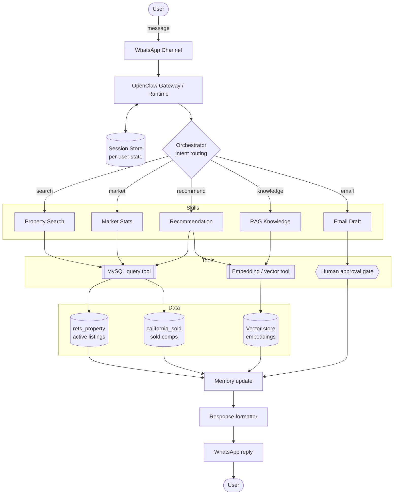

# Architecture - IDX Exchange Multi-Agent Real Estate Assistant

This document describes how a user's message travels from WhatsApp through the OpenClaw runtime to the MLS databases and back.

```mermaid
flowchart TD
    U([User]) -->|message| WA[WhatsApp Channel]
    WA --> GW[OpenClaw Gateway / Runtime]
    GW <--> SES[(Session Store<br/>per-user state)]
    GW --> ORC{Orchestrator<br/>intent routing}
 
    subgraph SKILLS[Skills]
        direction LR
        PS[Property Search]
        MS[Market Stats]
        REC[Recommendation]
        RAG[RAG Knowledge]
        EM[Email Draft]
    end
 
    ORC -->|search| PS
    ORC -->|market| MS
    ORC -->|recommend| REC
    ORC -->|knowledge| RAG
    ORC -->|email| EM
 
    subgraph TOOLS[Tools]
        direction LR
        T1[[MySQL query tool]]
        T2[[Embedding / vector tool]]
        APPROVE{{Human approval gate}}
    end
 
    PS --> T1
    MS --> T1
    REC --> T1
    REC --> T2
    RAG --> T2
    EM --> APPROVE
 
    subgraph DATA[Data]
        direction LR
        RP[(rets_property<br/>active listings)]
        CS[(california_sold<br/>sold comps)]
        VS[(Vector store<br/>embeddings)]
    end
 
    T1 --> RP
    T1 --> CS
    T2 --> VS
 
    RP & CS & VS --> MEM[Memory update]
    APPROVE --> MEM
    MEM --> FMT[Response formatter]
    FMT --> OUT[WhatsApp reply]
    OUT --> U2([User])
```
