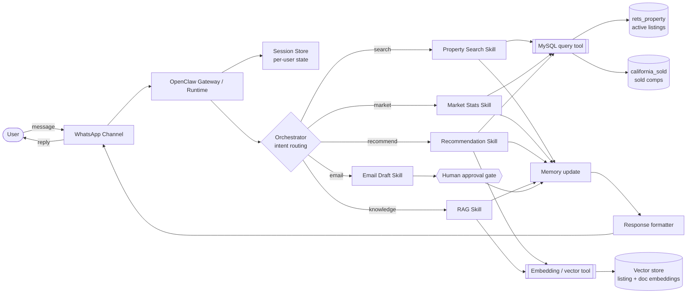
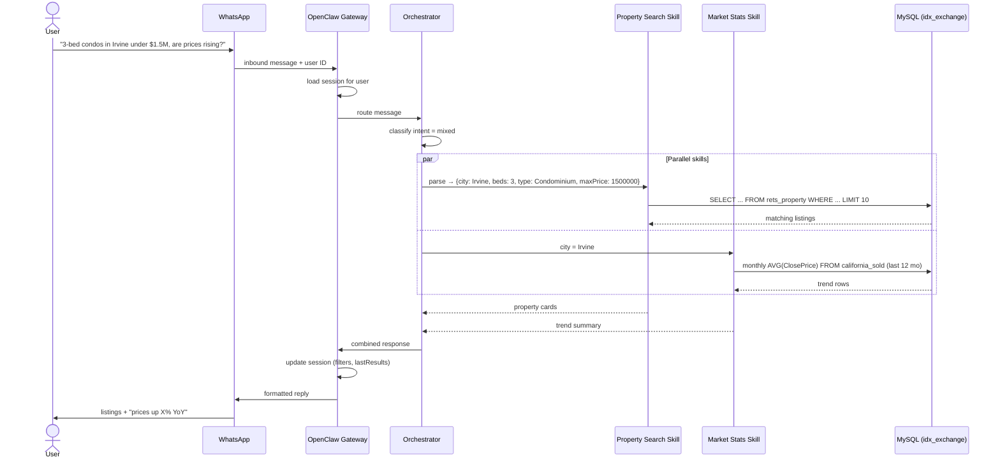

# Architecture — IDX Exchange Multi-Agent Real Estate Assistant

This document describes how a user's message travels from WhatsApp through the OpenClaw runtime to the MLS databases and back. It is the Week 1 deliverable and will be updated as each component is built (see [Build Roadmap](#build-roadmap)).

---

## 1. High-Level Flow



The pipeline matches the handbook's architecture flow:

**User → WhatsApp → OpenClaw Runtime → Skill Selector → Tool Execution → Memory Update → Response → User**

---

## 2. Components

| Component | Role | In this project |
|---|---|---|
| **Channels** | Communication interfaces that receive and send messages | WhatsApp (linked via QR, Week 0), web dashboard, email (Week 11) |
| **Gateway / Runtime** | Long-running OpenClaw process that receives channel events, manages sessions, and invokes the agent | Runs locally via Node; started during `openclaw onboard` |
| **Sessions** | Per-user conversation state, keyed by user/channel identity | Holds search filters, last results, and conversation step (Week 4) |
| **Orchestrator** | Classifies intent and routes to one or more skills; can run skills in parallel for mixed-intent queries | Intent classes: `search`, `market`, `recommend`, `knowledge`, `mixed` (Week 9) |
| **Skills** | Modular capability units, each owning one job | Property search, market stats, recommendations, RAG, email drafting |
| **Tools** | Typed async functions that skills call to act on the world | Parameterized MySQL queries, embedding generation, similarity search, email send |
| **Memory** | Short-term: current session state. Long-term: vector embeddings | Session map (Week 4); embeddings of `L_Remarks` and reference docs (Weeks 6, 8) |

> Note: OpenClaw's own terminology and file layout for skills, sessions, and tools may differ in detail from the handbook's simplified model. See `openclaw/docs` for the runtime's actual structure; this document describes the logical architecture of the assistant built on top of it.

---

## 3. Data Layer

Both tables live in the local MySQL database `idx_exchange`, accessed by a least-privilege user (`idx_user`) whose credentials are loaded from `.env`.

| Table | Rows (local import) | Contents | Used by |
|---|---|---|---|
| `rets_property` | 55,212 | Active CA listings, 130+ fields incl. `L_Remarks` (FULLTEXT indexed), photos, agent info | Property search, semantic search, recommendations |
| `california_sold` | 98,552 | Sold/closed transactions 2021–2025, 46 fields (RESO-standard names) | Market stats, comp validation |

**Join pattern**

```sql
JOIN rets_property r ON CAST(r.L_ListingID AS UNSIGNED) = cs.ListingKey
-- or, for market-level analysis: match on city + postal code
```

**Key field mappings (legacy → meaning)**

| `rets_property` | Meaning | `california_sold` equivalent |
|---|---|---|
| `L_SystemPrice` | List price | `ListPrice` |
| `L_Keyword2` | Bedrooms | `BedroomsTotal` |
| `LM_Dec_3` | Bathrooms | `BathroomsTotalInteger` |
| `LM_Int2_3` | Square footage | `LivingArea` |
| `L_City` / `L_Zip` | City / ZIP | `City` / `PostalCode` |
| `L_Type_` | Property subtype | `PropertySubType` |

---

## 4. Example Request Walkthrough

**Query (via WhatsApp):** *"Show me 3-bedroom condos in Irvine under $1.5M and tell me if prices are rising."*



1. **Channel:** WhatsApp delivers the message and sender ID to the gateway.
2. **Session:** The gateway loads the user's session, which holds any prior filters.
3. **Routing:** The orchestrator detects two intents (search + market) and runs both skills in parallel.
4. **Tool execution:** Each skill calls the MySQL tool with parameterized queries; no string-concatenated SQL.
5. **Memory update:** Filters and results are saved so a follow-up like *"only ones with a pool"* refines the same search.
6. **Response:** Results are merged and formatted for WhatsApp (max 5 listings per message).

---

## 5. Safety & Guardrails

| Rule | Enforcement |
|---|---|
| No outbound email without explicit approval | Email skill returns a `pending_approval` draft; send requires a confirmation step |
| Secrets never logged or committed | Credentials only in `.env`; `.env` and `*.sql` are in `.gitignore` |
| No bulk data export | Every query returns ≤ 50 rows |
| Safe SQL | All queries parameterized (`?` placeholders), never interpolated |
| Least privilege | App connects as `idx_user` (scoped to `idx_exchange`), not `root` |

---

## 6. Build Roadmap

| Week | Component | Status |
|---|---|---|
| 0 | Environment, MySQL import, WhatsApp link, API keys | ✅ Done |
| 1 | Architecture documentation (this file) | ✅ Done |
| 2 | NL query parser → structured filters | ⬜ |
| 3 | MySQL query layer (search + comps) | ⬜ |
| 4 | Multi-turn session memory | ⬜ |
| 5 | Market stats skill (`california_sold`) | ⬜ |
| 6 | Embeddings + semantic search (`L_Remarks`) | ⬜ |
| 7 | Hybrid recommendation engine + comp validation | ⬜ |
| 8 | RAG over primer, Trestle docs, schema reference | ⬜ |
| 9 | Orchestrator routing across all skills | ⬜ |
| 10 | End-to-end WhatsApp interface | ⬜ |
| 11 | Email agent with approval gate | ⬜ |
| 12 | Capstone demo | ⬜ |